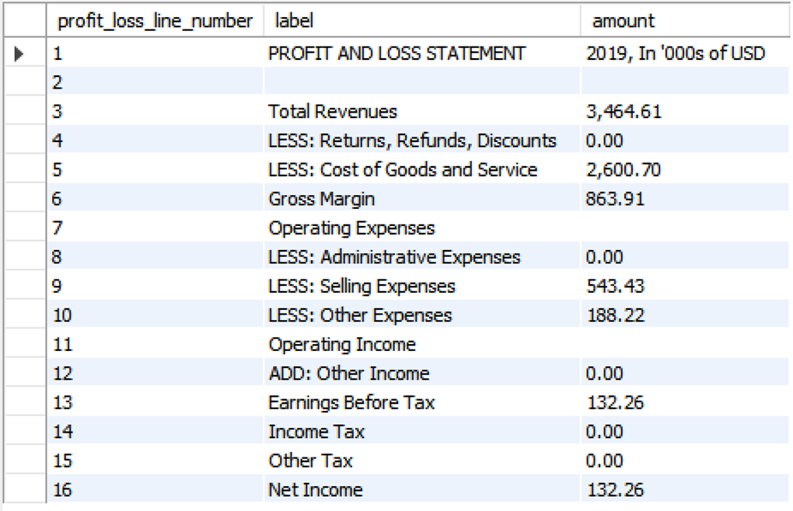
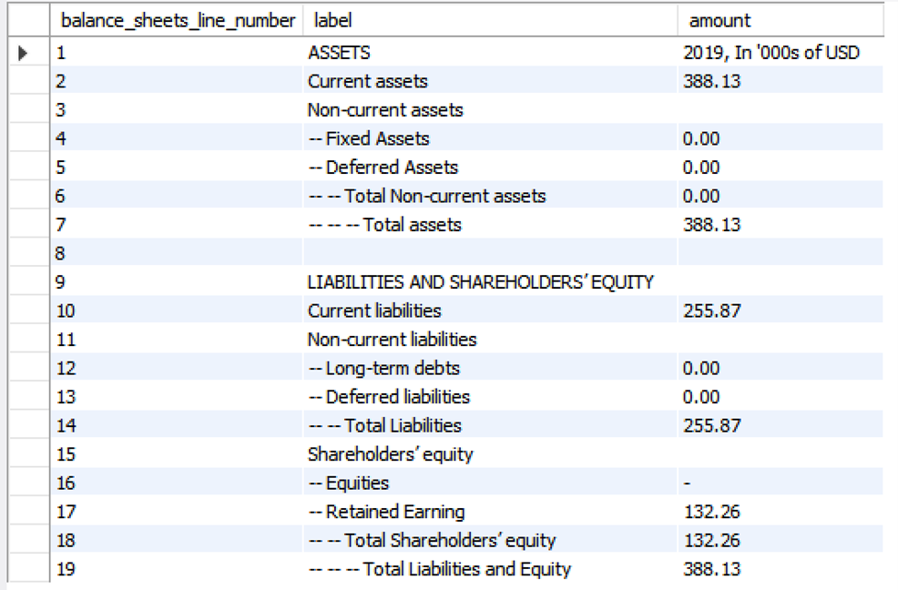

# Accounting Database

## Reflection Paper

Our team worked very well together as everyone was result-driven, hardworking and curious learner. We all took our initiatives to contribute to the team and were all very collaborative. We were active listeners as we listened carefully to each other’s thought processes and gave feedback accordingly. We also respected one another and enjoyed our conversations since we came from different professional and cultural backgrounds.

The first task of our teamwork procedure was to find the data for the different accounts for Profit and Loss and Balance Sheet. We first made an excel sheet to simulate the final output table for P&L and B/S. And then we looked at the ER diagram to see the relationships between each field and created a procedure in order to find the numbers we wanted for different accounts in different years and inputted the number we retrieved via SQL into excel. After reviewing everything was correct, we wrote the codes to formulate the tables and integrated our codes together for the final result. 

In general, Ching-Chih, Eva and Danqi worked on the Profit and Loss while Jisung worked on the Balance Sheet. Eva created the simulation excel sheet, worked specifically on the codes to retrieve data for Profit & Loss and tried to balance the statements. Jisung worked on codes for the Balance Sheet, table creation and modifying the final codes. Ching-Chi and Danqi worked on double-checking the codes and also retrieved the data to make sure the queries were correct. During the progression of the work, we all shared our own codes and modified them together in order to achieve the correct result. 

In the process of completing this challenge, we learned how to read the E/R diagram, create & drop database, create & drop table, use From SELECT, create/drop views and stored procedures. The key SQL learning is that we realize the importance of reading and understanding the E/R diagram before starting to write the queries. It is similar to the process of building a house, comprehending the E/R diagram is like building the foundation and core framework of the house, which determines the success of whether the house will stand nicely and firmly. 

If we were to do the challenge all over again, we would spend more time on analyzing the ER diagram and finding the relationships between each field instead of struggling with how to balance the balance sheet. While working on this challenge, we learned that we need to be clear with what our roles are and what our final goal is for the specific project. Even though the database was on accounting, it was not our responsibility or goal to try to balance the balance sheet and try to find ways to justify the legitimacy of the data. We should focus on whether the relations between fields are correct, queries are written in the correct way to retrieve the data we want, and the final table output can be generated in a professional format. If the data we retrieve doesn’t seem to be correct, we should be confident with our codes and notify the database administrator that data entry should be modified, and the database should be managed in a more organized way.

## Output of the Profit and Loss Statement

## Output of the Balance Sheet

